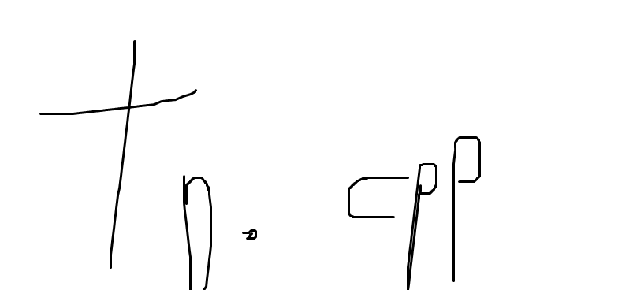

to.cpp
====



__brings type conversion features in modern C++.__

to::_types
----
  ```c++
  std::cout<< to::_int("4132"); // 4132
  std::cout<< to::_unsigned_int("9999999999999999999999999999"); // out_of_range exception
  ```
  
  * __Supported Types__
    * signed/unsigned int
    * signed/unsigned long
    * 나중에 추가
  
to::_string
----

  __Fundamental types__<br>
  C++ 기본 타입들에는 내장 변환기가 사용됩니다.
  ```c++
  int v = 1234;
  std::cout<< to::_string(v); // 1234
  std::cout<< to::_string(4.44f); // 4.44
  
  bool b = true;
  std::cout<< to::_string(b); // true
  
  // 포인터는 타입 이름 + 주소값으로 변환됩니다.
  int *ptr = &v;
  std::cout<< to::_string(v); // #<int * 0000abcd>
  
  std::cout<< to::_string(nullptr); // #<std::nullptr_t 00000000>
  
  // char *, const char *, char [], const char[] 타입은 포인터로 취급되지 않고 문자열로 취급됩니다.
  char *s = "hello world";
  std::cout<< to::_string(s); // hello world
  ```
  __STL Containers__<br>
  STL 컨테이너들에는 내장 변환기가 사용됩니다.
  ```c++
  std::vector<int> v({1,2,3,4});
  std::cout<< to::_string(v); // [1, 2, 3, 4]
  
  std::map<std::string, std::string> m({
    {"name", "park"},
    {"chicken", "good"}});
  std::cout<< to::_string(m); // {name : park, chicken : good}
  
  std::map<std::string, std::vector<std::string>> m2({
    {"fruits", {"apple", "banana", "orange"}},
  	{"colors", {"yellow", "red", "blue"}}});
  std::cout<< to::_string(m2); // {fruits : [apple, banana, orange], colors : [yellow, red, blue]}
  
  std::string str = "hello world";
  std::cout<< to::_string(str); // hello world
  
  std::cout<< to::_string({1,2,3,4}); // [1, 2, 3, 4]
  std::cout<< to::_string({{1,2}, {3,4}}); // not implemented yet
  
  std::initializer_list<std::initializer_list<int>> l({{1,2}, {3,4}});
  std::cout<< to::_string(l); // [[1, 2], [3, 4]]
  ```
  __Custom Classes__<br>
  직접 만든 클래스에 to_string 메소드를 구현하여 클래스에 대한 커스텀 문자열 변환기를 만들 수 있습니다.
  ```c++
  class Foo{
  public:
    int v;
    
    std::string to_string() const{
      return "#<Foo v:" + to::_string(v) + ">";
    }
  }
  ```
  ```c++
  Foo f;
  f.v = 15;
  
  std::cout<< to::_string(f); // #<Foo v:15>
  ```
  
  __ToString Generator__<br>
  `CREATE_TO_STRING()` 매크로를 사용하면 클래스에 대한 문자열 변환기를 자동으로 생성합니다.
  ```c++
class weapon {
public:
	CREATE_TO_STRING(damage, level)

	int damage = 123;
	int level = 1;
};
class item {
public:
	CREATE_TO_STRING(name, qty)

	std::string name;
	int qty = 5;
};
class player {
public:
	CREATE_TO_STRING(hp, weapon, inventory)

	int hp = 100;
	weapon weapon;
	std::vector<item> inventory;
	int a_secret_one = 1234;
};
  ```
  ```c++
player a;
item item1, item2;
item1.name = "SWORD";
item2.name = "CHICKEN";
a.inventory.push_back(item1);
a.inventory.push_back(item2);
printf("%s\n", a.to_string().c_str());
  ```
  출력 결과물 (가독성을 위해 수동으로 줄바꿈 하였습니다, 실제 결과는 줄바꿈이 없습니다.)
  ```
#<class player
  inventory : [
    #<class item  qty : 5, name : SWORD>,
    #<class item  qty : 5, name : CHICKEN>], 
  weapon : #<class weapon  level : 1, damage : 123>,
  hp : 100>
  ```
  <br>
  사용 가능한 변환이 없을 경우에는 타입 이름과 주소값이 함께 출력됩니다.
  ```c++
  Bar b;
  std::cout<< to::_string(b); // #<Bar 00001234>
  ```
  __has_string_converter__<br>
  사용 가능한 문자열 변환기가 있는지 검사합니다.
  ```c++
  /* int형은 내장 변환기가 있으므로 true */
  std::cout<< to::has_string_converter<int>::value; // true
  
  /* Foo 클래스는 to_string 메소드를 구현해 커스텀 변환기를 만들었으므로 true */
  std::cout<< to::has_string_converter<Foo>::value; // true
  /* Bar 클래스는 구현하지 않았으므로 false */
  std::cout<< to::has_string_converter<Bar>::value; // false
  ```

Options
----
* __TO_STRING_WITH_QMARKS__<br>
  std::string, char *, const char *형에 대해 to::_string을 수행할 때 문자열의 앞뒤로 `"`를 삽입합니다.<br>
  이 옵션을 활용하면 STL 컨테이너에서 json 스트링을 빌드할 수 있습니다.

  ```cpp
  #define TO_STRING_WITH_QMARKS
  
  std::map<std::string, std::vector<std::string>> m2({
    {"fruits", {"apple", "banana", "orange"}},
  	{"colors", {"yellow", "red", "blue"}}});
  std::cout<< to::_string(m2); // {"fruits" : ["apple", "banana", "orange"], "colors" : ["yellow", "red", "blue"]}
  ```

TODO
----
* ToString 생성기에 상속 지원
